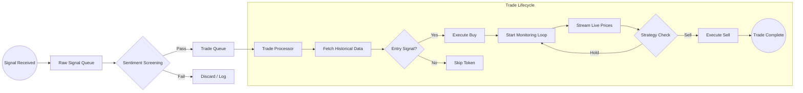
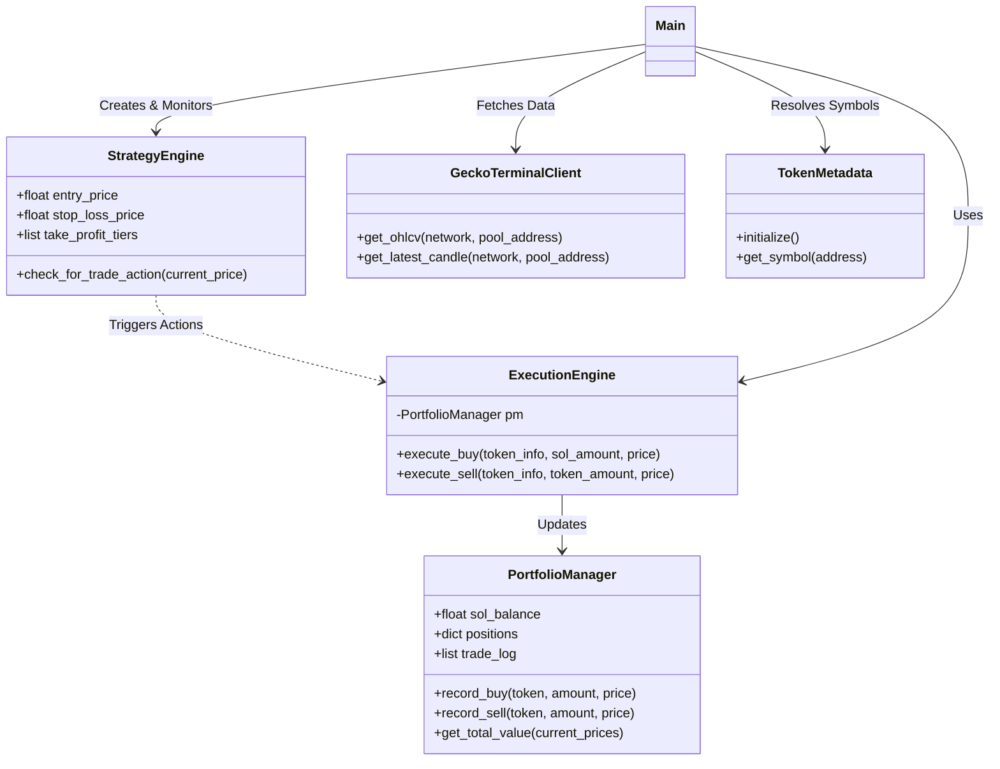
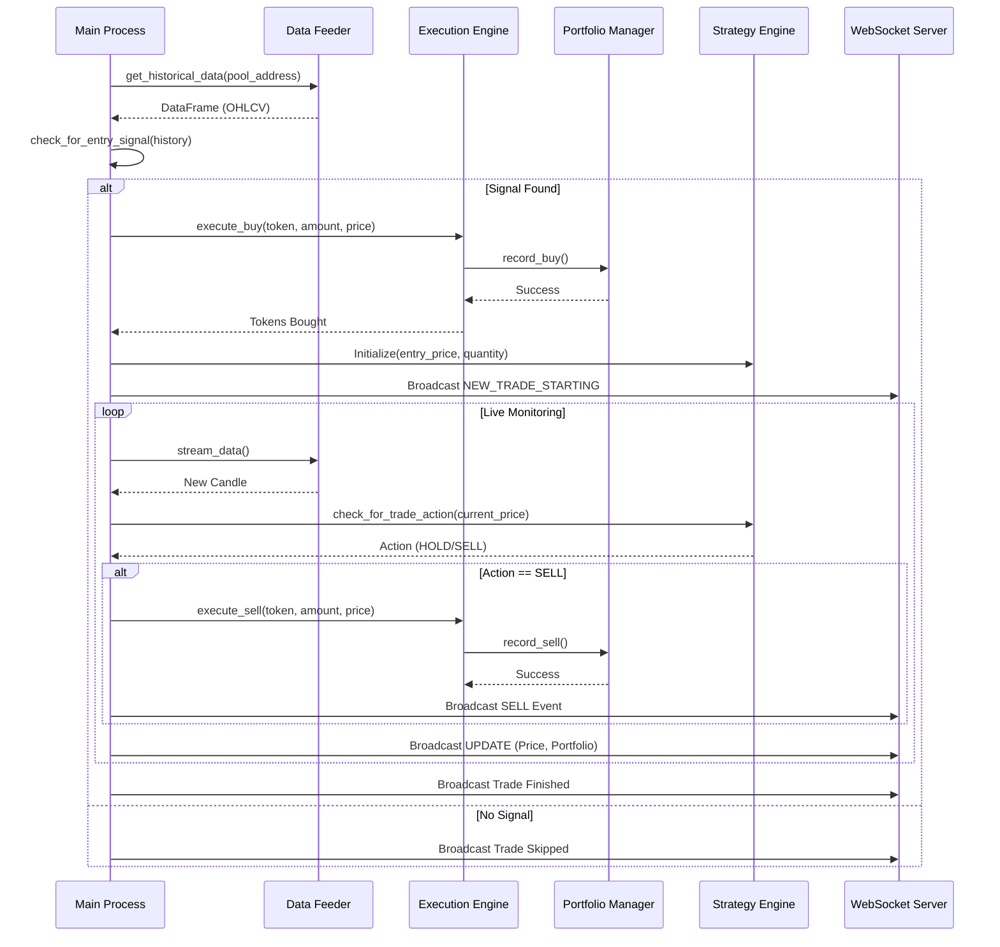

# Research Diagrams

This document contains Mermaid diagrams illustrating the architecture, data flow, and logic of the Auto-Trader system. You can render these diagrams using a Mermaid-compatible viewer or editor (like the Mermaid Preview extension in VS Code).

## 1. System Architecture

This diagram provides a high-level overview of the system components and their interactions.

```mermaid
graph TD
    subgraph "Frontend (React/TypeScript)"
        UI[User Interface]
        Chart[Candlestick Chart]
        Feed[Transaction Feed]
        Summary[Trade Summary Panel]
        WS_Client[WebSocket Client]
    end

    subgraph "Backend (Python/Asyncio)"
        WS_Server[WebSocket Server]
        Main[Main Event Loop]
        
        subgraph "Core Modules"
            PM[Portfolio Manager]
            EE[Execution Engine]
            SE[Strategy Engine]
            TM[Token Metadata]
        end
        
        subgraph "Data & Signals"
            SSE_Listener[SSE Signal Listener]
            Sent_Proc[Sentiment Processor]
            Data_Feeder[Data Feeder]
        end
    end

    subgraph "External Services"
        GT_API[GeckoTerminal API]
        Signal_Source[Signal Provider (SSE)]
    end

    %% Connections
    Signal_Source -->|Stream Signals| SSE_Listener
    SSE_Listener -->|Raw Token Info| Sent_Proc
    Sent_Proc -->|Validated Token| Main
    
    Main -->|Manage| PM
    Main -->|Execute Trades| EE
    Main -->|Monitor Strategy| SE
    
    Data_Feeder -->|OHLCV Data| GT_API
    Main -->|Request Data| Data_Feeder
    
    WS_Server <-->|Real-time Updates| WS_Client
    WS_Client --> UI
    UI --> Chart
    UI --> Feed
    UI --> Summary
    
    Main -->|Broadcast State| WS_Server
```

## 2. Data Processing Pipeline

This diagram illustrates the flow of a token signal from detection to trade execution and completion.



## 3. Class Relationships

This diagram shows the structure and relationships of the key Python classes in the backend.



## 4. Trade Execution Sequence

This sequence diagram details the interactions during the `process_single_token` workflow.


